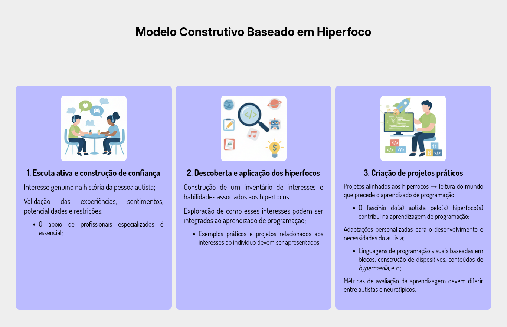
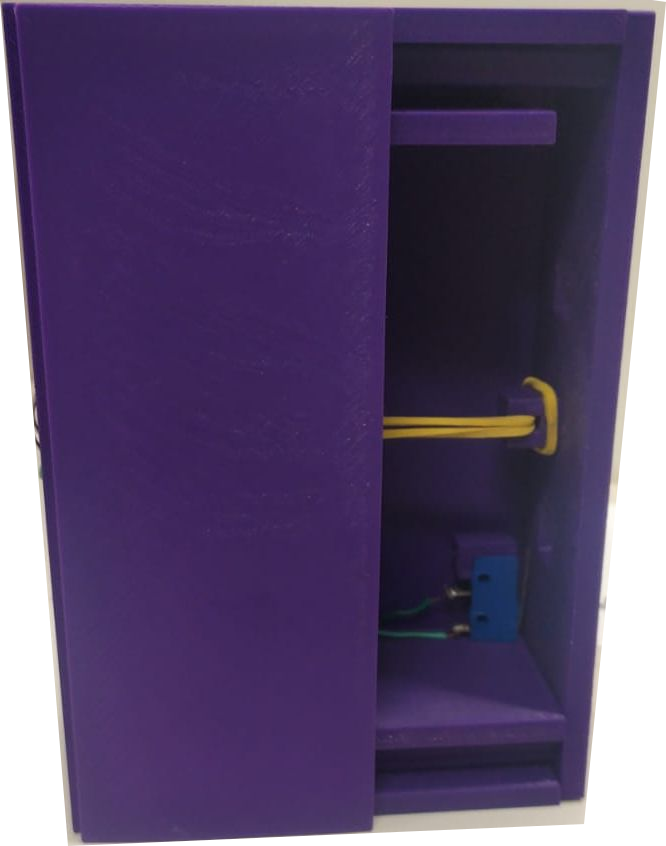
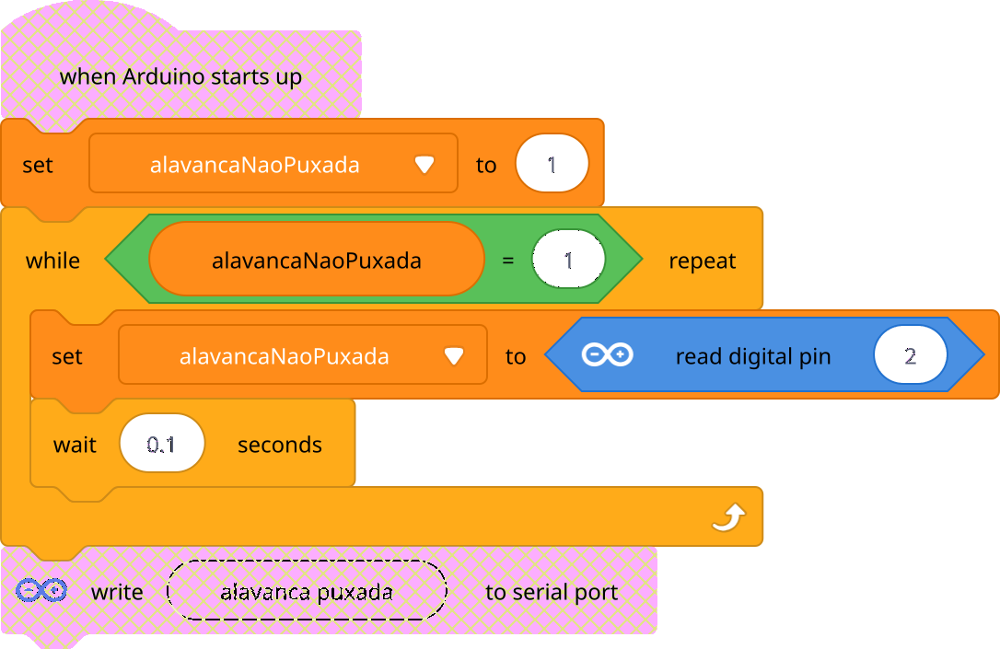
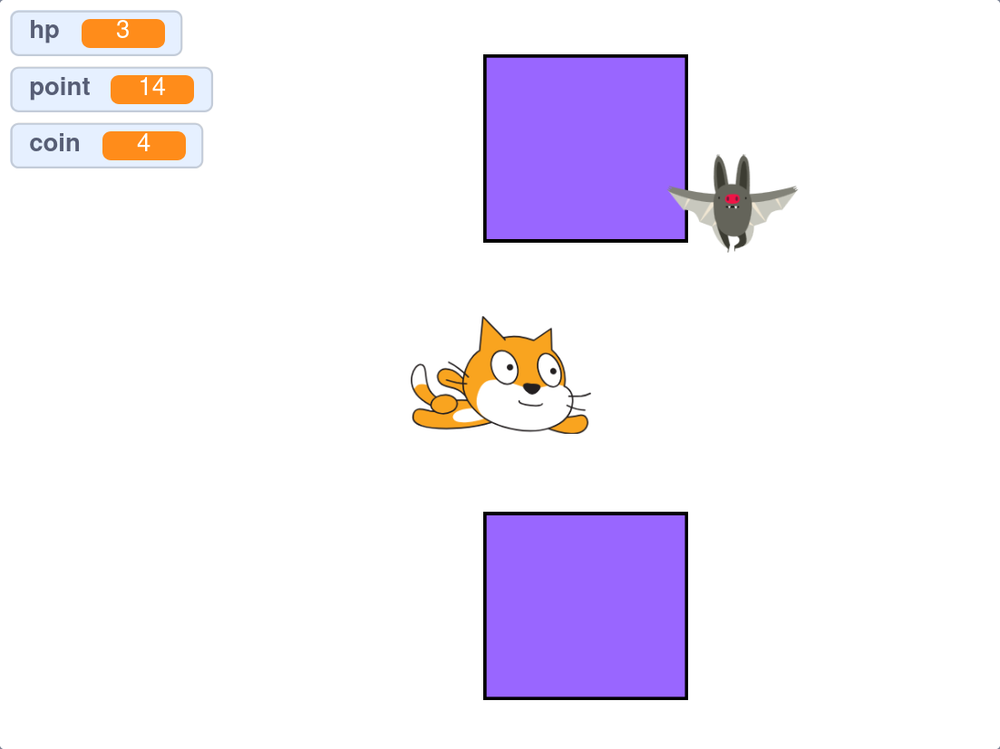

---
header-includes:
  - |
    ```{=latex}
    % thanks (como no \author) para mostrar instituição do autor
    % como nota de rodapé
    \makeatletter
    \renewcommand\thefootnote{\arabic{footnote}}
    \makeatother

    \usepackage{caption}

    \usepackage{float}
    \usepackage{graphicx}
    \usepackage{setspace}
    % Ambiente Fonte: centralizado, espaçamento 1, itálico, sem espaço extra
    \newenvironment{Fonte}
      {\par\begin{center}\begingroup\setstretch{1}\small}
      {\par\endgroup\end{center}}

    \usepackage{titling}
    \setlength{\droptitle}{-1.2cm} % sobe tudo

    % cabeçalhos e rodapés
    \usepackage{fancyhdr}
    \pagestyle{fancy}
    \fancyhf{} % limpa cabeçalho/rodapé

    % Cabeçalho à esquerda (2 linhas)
    \fancyhead[L]{%
      \begin{tabular}[t]{@{}l@{}}
        II Seminário Mineiro de EPT\\
        25 a 27 de setembro de 2025
      \end{tabular}
    }

    % Rodapé central (2 linhas), sem número de página
    \fancyfoot[C]{%
      \begin{tabular}[t]{@{}c@{}}
        II Seminário Mineiro de Educação Profissional e Tecnológica\\
        25 a 27 de setembro de 2025
      \end{tabular}
    }

    % sem linhas de regra no topo/rodapé
    \renewcommand{\headrulewidth}{0pt}
    \renewcommand{\footrulewidth}{0pt}

    % Alinhamento com a largura do texto
    \fancyheadoffset{0pt}
    \fancyfootoffset{0pt}

    % Garante que a página "plain" (ex.: após \maketitle) use o mesmo estilo
    \fancypagestyle{plain}{%
      \fancyhf{}
      \fancyhead[L]{%
        \begin{tabular}[t]{@{}l@{}}
          II Seminário Mineiro de EPT\\
          25 a 27 de setembro de 2025
        \end{tabular}
      }
      \fancyfoot[C]
    APRENDIZAGEM BASEADA EM HIPERFOCOS: PROJETOS DE PROGRAMAÇÃO COM ESTUDANTES AUTISTAS
author:
    - "\\href{mailto:ascanio@cefetmg.br}{M.Sc. Diego Ascânio Santos} \\thanks{Departamento de Computação, CEFET-MG, Divinópolis, MG, Brasil.}"
    - "\\href{mailto:thabatta@cefetmg.br}{Drª. Thabatta Moreira Alves de Araújo}\\footnotemark[1]" # para mesma filiação do autor anterior, use footnotemark correspondente
    - "\\href{mailto:andeersonribeiro@cefetmg.br}{M.Sc. Anderson Ribeiro de Oliveira Santos Silva}\\thanks{Departamento de Educação, CEFET-MG, Divinópolis / Belo Horizonte, MG, Brasil.}"
date: 21 setembro 2025
lang: pt-BR

# Citações e bibliografia (ABNT)
csl: https://www.zotero.org/styles/associacao-brasileira-de-normas-tecnicas
bibliography: references.bib          # opcional; pode usar só o bloco 'references:' abaixo
citeproc: true
link-citations: true
reference-section-title: "Referências"

# Aparência (LaTeX/PDF)
documentclass: article
fontsize: 12pt
linestretch: 1.5
papersize: a4
geometry:
  - left=3cm
  - right=2cm
  - top=3cm
  - bottom=2cm
  - includehead
  - includefoot
  - headheight=28pt   # altura do cabeçalho
  - headsep=10pt      # espaço entre cabeçalho e texto
  - footskip=20pt     # distância do rodapé ao texto
  - heightrounded
indent: true
toc: false 
toc-title: "Sumário"
toc-depth: 2
abstract-title: "Resumo"

# Palavras-chave ficam também nos metadados (além de impressas abaixo do Resumo)
keywords:
  - palavra-chave 1
  - palavra-chave 2
  - palavra-chave 3

# Numeração de seções
numbersections: true

# Exemplos embutidos de referências (use estes ou troque pelo seu .bib)
references:
  - id: silva2020
    author:
      - family: Silva
        given: João P.
    issued:
      - year: 2020
    title: Introdução à Pesquisa Científica
    publisher: Editora Acadêmica
    type: book
    publisher-place: São Paulo
  - id: souza2022
    author:
      - family: Souza
        given: Maria A.
      - family: Pereira
        given: Carlos H.
    issued:
      - year: 2022
    title: "Modelagem e otimização em sistemas discretos"
    container-title: Revista Brasileira de Pesquisa Operacional
    volume: 42
    issue: 3
    page: 123-145
    type: article-journal
    DOI: 10.1234/rbpo.v42i3.2022
  - id: abnt6023
    author:
      - family: ABNT
        literal: Associação Brasileira de Normas Técnicas
    issued:
      - year: 2018
    title: NBR 6023 — Informações e documentação — Referências — Elaboração
    type: standard
---

**Resumo**

Este trabalho relata a experiência de aplicar os hiperfocos de dois estudantes autistas do CEFET-MG – campus Divinópolis como motivadores no ensino-aprendizagem de programação. A partir de escuta ativa e da concessão de protagonismo, os estudantes apresentaram seus hiperfocos — interesses sustentados e hiperdesenvolvidos em temas como ônibus, jogos eletrônicos, desenho e capitais de países — e, com base neles, conteúdos e tarefas foram adaptados para gerar significado pessoal. Três aplicações foram desenvolvidas: (i) um controlador de “alavanca de pânico” para notificação de importunações no transporte público, decorrente do hiperfoco em ônibus; e (ii) dois jogos de computador, alinhados aos hiperfocos em jogos e pixel art. O percurso didático envolveu tarefas autênticas, ciclos curtos de prototipação, feedback formativo e mediação docente na medida suficiente. Os resultados foram satisfatórios: ambos os estudantes aprenderam a construir programas para resolver problemas próprios, ampliaram o repertório técnico e avançaram para além do que haviam alcançado com metodologias tradicionais. Uma das aplicações — a alavanca de pânico — obteve 2o lugar na categoria “Ciências Aplicadas em Ciências Humanas e Sociais” na 33a META do CEFET-MG – Divinópolis (dez/2024). As evidências sugerem que a integração pedagógica de hiperfocos pode favorecer um ensino efetivo e intelectualmente honesto, sensível às fases de desenvolvimento e às possíveis limitações cognitivas de estudantes autistas, em consonância com a teoria de Bruner. Como limitação, trata-se de estudo de caso com N=2 e sem grupo de comparação; propõe-se, como trabalho futuro, estudos longitudinais e protocolos replicáveis em diferentes níveis de ensino.

**Palavras-chave:** autismo; hiperfoco; educação em programação.

# Introdução {#sec:introducao}

O método de alfabetização de Paulo Freire apresenta como etapa inicial a investigação da realidade dos alfabetizandos para a proposição de palavras geradoras, pois, segundo Freire, a leitura do mundo precede a leitura das palavras [ @freire1967 ].

O Hiperfoco de pessoas autistas é uma característica presente em vários indivíduos portadores do TEA que caracteriza o interesse intenso por temas e atividades por vezes bastante específicos e peculiares tais quais: dinossauros, astronomia, bandeiras, capitais de países, trens, ônibus, meios de transporte, jogos eletrônicos, dentre outros [ @ashinoff2021 ].

Desenvolver atividades ligadas aos hiperfocos é egossintônico às pessoas autistas e acaba ganhando contornos autotélicos, uma vez que o desenvolvimento de tais atividades desperta prazer, sentimentos positivos e constantemente coloca indivíduos autistas em estado de _flow_^[ Teoria de psicologia desenvolvida por @csikszentmihalyi1990 ].

Este trabalho, inspirado na etapa inicial da alfabetização freireana, no hiperfoco de pessoas autistas e na teoria do _flow_, propõe hiperfocos como geradores de contexto para aprendizado de programação para pessoas autistas pelas características autotélicas que tais hiperfocos possuem, dotando o processo da aprendizado de uma linguagem de programação, que também pode ser considerado como um letramento digital, de sentido precedente à simples apresentação das palavras — instruções, comandos, códigos — do alfabeto digital. 

# Referencial teórico {#sec:referencial-teorico}

## Método Freireano de Alfabetização

O método de alfabetização de Paulo Freire fundamenta-se em uma pedagogia crítica que busca superar a chamada educação bancária — aquela em que o professor deposita conhecimento no aluno —, propondo uma prática dialógica e libertadora. Para Freire, alfabetizar não se reduz à aprendizagem mecânica de letras e palavras, mas constitui um processo de conscientização em que o educando aprende a “ler o mundo” antes de “ler a palavra”. Nesse sentido, o método parte de “palavras geradoras”, retiradas do universo concreto dos alunos, como instrumento para promover uma alfabetização contextualizada e crítica [ @freire1967; @gadotti1996 ].

A primeira experiência sistematizada ocorreu em Angicos (RN), em 1963, quando aproximadamente 300 trabalhadores foram alfabetizados em apenas 45 dias. O método freiriano organiza-se em três momentos principais: a investigação do universo vocabular dos educandos, a tematização das palavras geradoras e a problematização crítica dos temas emergentes. Assim, a alfabetização deixa de ser um ato meramente técnico e transforma-se em ato político, no qual os sujeitos compreendem sua condição histórica e se reconhecem como agentes transformadores da realidade [ @freire1968; @brandao1981 ].

Com o tempo, a proposta de Freire influenciou políticas públicas no Brasil e em diversos países, sendo apropriada por programas de alfabetização de jovens e adultos em escala internacional. Essa perspectiva integra linguagem, cultura e poder, reafirmando o caráter emancipador da educação. Autores como @torres1987 e @macedo1987 aprofundaram a discussão sobre a pedagogia freiriana, destacando seu papel na construção de práticas educativas democráticas e socialmente comprometidas. Reconhecido pela UNESCO, como apresentado por @guimaraes2021, o legado de Paulo Freire permanece atual e inspira debates contemporâneos sobre educação popular, justiça social e pedagogia crítica.

## Hiperfoco

O hiperfoco pode ser definido como um estado de concentração intensa e prolongada em uma atividade específica, frequentemente acompanhado pela exclusão de outros estímulos do entorno — ambientais e/ou sociais [ @ashinoff2021 ]. No caso de pessoas com Transtorno do Espectro Autista (TEA), essa característica assume uma ambivalência: de um lado, pode levar ao desinteresse ou negligência de tarefas cotidianas que não dialogam com seus interesses imediatos; de outro, quando orientado adequadamente, pode ser convertido em um recurso motivacional poderoso para o aprendizado. Trabalhos recentes destacam que o hiperfoco costuma estar associado a sentimentos positivos vivenciados durante atividades de interesse, o que reforça seu potencial pedagógico [ @hupfeld2022 ].

No campo educacional, abordagens tradicionais frequentemente falham em engajar estudantes autistas justamente pela ausência de contextos significativos e fatores motivacionais conectados aos seus perfis cognitivos singulares. O reconhecimento do hiperfoco como uma forma de atenção diferenciada abre caminho para metodologias inclusivas que, em vez de confrontar esse traço, buscam incorporá-lo ao processo de ensino-aprendizagem. Como apontam estudos recentes, ao alinhar conteúdos escolares a áreas de interesse intenso — como, por exemplo, jogos digitais —, educadores podem promover maior engajamento, facilitar a aquisição de habilidades complexas e estimular a autonomia [ @deOliveira2019 ].

A ambivalência do hiperfoco e as características negativas intrínsicas à possíveis ausências de controle consciente durante os episódios em que ocorre, bem como a seus efeitos colaterais negativos previamente mencionados — como a negligência a tarefas cotidianas como se alimentar, cuidar da higiene pessoal ou interagir socialmente — fazem com que o hiperfoco seja percebido de forma depreciativa por muitos educadores e familiares de pessoas autistas. No entanto, existem evidências — [ @ashinoff2021; ] — que sugerem que o hiperfoco e o _flow_^[Comportamento psicológico amplamente elogiado e incentivado na sociedade contemporânea, apresentado na próxima seção] são os mesmos fenômenos compreendidos em perspectivas distintas.

## Teoria Psicológica do _Flow_

A teoria psicológica do _flow_, desenvolvida por Mihaly Csikszentmihalyi, descreve um estado mental de imersão completa em uma atividade, caracterizado por foco intenso, perda da noção do tempo, e sensação de prazer intrínseco. Segundo @csikszentmihalyi1990 _apud_ @siqueira2025, o _flow_ ocorre quando há um equilíbrio entre os desafios da tarefa e as habilidades do indivíduo, favorecendo um desempenho ótimo. Este estado é particularmente relevante em contextos criativos, esportivos, educacionais e laborais, onde a motivação intrínseca desempenha papel central no engajamento e na produtividade.

Pesquisas mais recentes têm revisitado e expandido a teoria do _flow_, aplicando-a a novos contextos como a jardinagem, ambientes digitais e educação ambiental. Por exemplo, @vieira2025 exploraram o estado de _flow_ na prática de jardinagem sob a ótica da Psicologia Positiva e Ambiental, apontando como atividades cotidianas podem favorecer bem-estar psicológico quando vivenciadas em estados de fluxo. Já @assumpcao2025 discutem o sentido existencial do _flow_, propondo uma interseção entre a abordagem de @csikszentmihalyi1990 e autores como @hosle2003, ampliando o escopo filosófico da teoria.

Essas releituras contemporâneas demonstram que a teoria do _flow_ permanece relevante para compreender a relação entre subjetividade, atividade e realização pessoal. Os autores contemporâneos reconhecem a importância da proposta original de @csikszentmihalyi1990, mas também indicam sua adaptabilidade a diferentes campos da psicologia moderna. Isso sugere que o _flow_ é uma construção teórica viva, que continua a inspirar investigações sobre a natureza da experiência humana e as condições que a tornam significativa.

## Linguagens de Programação

As linguagens de programação constituem um sistema de notação formal que permite descrever, de forma precisa, instruções que podem ser interpretadas por humanos e executadas por máquinas [@louden2003]. Essenciais para o desenvolvimento de soluções computacionais, elas podem ser classificadas conforme diferentes critérios, como o paradigma de programação, o tipo de tradução ou o nível de abstração. No contexto deste trabalho, no entanto, a distinção entre linguagens **textuais** (como Python, C, Lua e JavaScript) e **visuais** (como Scratch, Node-RED e Delphi) é mais relevante, especialmente por sua relação com a **acessibilidade** e a **curva de aprendizagem**.

O ensino de programação ainda enfrenta desafios importantes, principalmente devido à complexidade na introdução de novos paradigmas e estruturas mentais, como abstração, lógica formal e algoritmização. Tais dificuldades são acentuadas com o uso de linguagens exclusivamente baseadas em texto, que exigem maior atenção à sintaxe e à estrutura formal. Em contrapartida, ambientes de programação visual baseados em blocos oferecem uma **alternativa mais intuitiva**, pois **reduzem a carga cognitiva inicial** e facilitam o foco na lógica e no raciocínio computacional, sem a necessidade de conhecimento prévio de comandos textuais [@souza2021; @marinho2022].

A baixa barreira de entrada das linguagens de programação visuais, especialmente as baseadas em blocos, tem sido valorizada em contextos educacionais. Nesses ambientes, a redução da complexidade sintática permite que o foco seja direcionado à lógica e ao raciocínio computacional. A linguagem **_Scratch_**, por exemplo, tem sido amplamente utilizada como ferramenta pedagógica no ensino de conceitos matemáticos, proporcionando uma abordagem lúdica, interativa e significativa. Sua aplicação em ambientes escolares também potencializa a criatividade e o engajamento dos estudantes, tornando a aprendizagem mais acessível. Guias de aplicação sistemática dessa linguagem na educação básica apontam sua eficácia na introdução de noções fundamentais de programação e no desenvolvimento do pensamento computacional [@silva2022; @souza2018].

Transcorridos os conceitos fundamentais para o entendimento do trabalho, são apresentados na próxima seção Trabalhos Relacionados que investigam hiperfocos, teoria do flow e o comportamento de pessoas autistas aplicados a contextos educacionais.

# Trabalhos Relacionados

Esta seção de trabalhos relacionados apresenta o empenho possível de verificação do estado da arte sobre o tema do presente trabalho considerando o exíguo período de tempo disponível para sua elaboração. Neste sentido, o esforço empreendido permitiu a identificação de seis trabalhos relacionados que investigam a aplicação de hiperfocos, teoria do _flow_ e temas correlatos em contextos educacionais, conforme sumarizado na Tabela \ref{tab:trabalhosrelacionados}, organizada por autor, tipo, título e objetivo principal.


\tiny
\captionsetup{font=normalsize}
\renewcommand{\arraystretch}{1.5}

| Autor(es) | Tipo | Título | Objetivo Principal |
|-----------|------|--------|--------------------|
| [@grotewiel2023] | Artigo | Experiences of hyperfocus and flow in college students with and without Attention Deficit Hyperactivity Disorder (ADHD) | Investigar a relação entre hiperfoco e flow em estudantes universitários, comparando aqueles com e sem sintomas clinicamente significativos de TDAH, a fim de verificar se esses estados representam fenômenos distintos ou apenas perspectivas diferentes de uma mesma experiência de absorção em tarefas. |
| [@perrin2023] | Tese de doutorado | A sense of purpose: Perspectives of autistic young people | Explorar como jovens autistas no Reino Unido vivenciam e conceituam o “sentido de propósito”, investigando suas experiências cotidianas e perspectivas de futuro, a fim de avaliar se trabalhar esse conceito pode favorecer seu bem-estar. |
| [@tjarks2024] | Monografia        | Unraveling the Complex Interplay Between Intrinsic Motivation, Hyperfocus, and Academic Performance | Examinar se o hiperfoco atua como mediador entre a motivação intrínseca e o desempenho acadêmico de estudantes universitários, investigando suas relações e implicações para o sucesso acadêmico. |
| [@swingler2024] | Dissertação de Mestrado | TEACHING STUDENTS WITH ADHD: Secondary teachers' experiences of adapting classroom practice to cater to the needs of students with ADHD | Compreender como professores australianos do ensino médio adaptam suas estratégias de manejo de sala de aula para apoiar estudantes com TDAH, considerando fatores contextuais que influenciam suas práticas e percepções. |
| [@bailey2024] | Tese de doutorado | Neurodiversity and Learning Engagement in Higher Education | Investigar, sob a lente da neurodiversidade, como estudantes neurodivergentes — com foco em autistas e também em alunos com TDAH e ansiedade — vivenciam engajamento e inclusão em contextos de ensino superior, propondo e validando um novo instrumento para avaliar experiências de aprendizagem e identificar barreiras e oportunidades de adaptação pedagógica. |
| [@hendry2025] | Artigo | Learning from the community: iterative co-production of a programme to support the development of attention, regulation and thinking skills in toddlers at elevated likelihood of autism or ADHD | Superar abordagens cognitivo-comportamentais tradicionais centradas na redução de sintomas diagnósticos, propondo uma intervenção afirmativa da neurodiversidade que apoia o desenvolvimento das funções executivas de crianças autistas ou com TDAH. Essa intervenção busca aproveitar características neurodivergentes — como o hiperfoco — para reduzir o estresse causado por práticas tradicionais. |

Table: Trabalhos relacionados. \label{tab:trabalhosrelacionados}

\renewcommand{\arraystretch}{1}
\normalsize

::: fonte
Fonte: Elaborado pelos autores.
:::

Apesar da quantidade de trabalhos identificados ser pequena, é possível observar que todos eles são recentes — publicados a partir de 2023 — o que indica que o tema é emergente e que, possívelmente, há um campo fértil para investigações futuras. Ademais, nenhum dos trabalhos verificados aborda o ensino de programação para pessoas autistas utilizando hiperfocos como geradores de contexto, o que reforça a originalidade do presente trabalho. Sem considerações adicionais sobre trabalhos relacionados a serem efetuadas, a próxima seção apresenta a metodologia proposta.

# Metodologia {#sec:metodologia}

Esta seção de metodologia apresenta o modelo construtivo baseado em hiperfoco — sintetizado pela Figura \ref{fig:modelohiperfocos} — baseado em três passos adaptáveis e individualizáveis conforme o perfil da pessoa autista e seu(s) hiperfoco(s):

1. Escuta ativa e construção de confiança;
2. Descoberta e aplicação de hiperfocos;
3. Criação de projetos com base nos hiperfocos.

Cada um dos passos acima é apresentado, respectivamente, nas subseções \ref{subsec:escuta}, \ref{subsec:descoberta} e \ref{subsec:criacao}.

{#fig:modelohiperfocos width=100% placement=H}

::: fonte
Fonte: Elaborado pelos autores.
:::

## Escuta ativa e construção de confiança {#subsec:escuta}

A escuta ativa pode se iniciar a partir de uma aproximação genuína com a realidade do estudante autista. É recomendável demonstrar interesse por seu universo, valorizando sua forma de perceber e interagir com o mundo. Nesse processo, torna-se possível identificar aspectos que podem afetar seu cotidiano, como restrições alimentares, sensoriais ou comportamentais. A partir dessa compreensão, abrem-se caminhos para oferecer recursos e apoios que contribuam para minimizar dificuldades e promover maior bem-estar.

Esse movimento de aproximação tende a ser essencial para o estabelecimento de vínculos de confiança. Muitos estudantes autistas já vivenciaram situações de preconceito, exclusão ou capacitismo, o que pode gerar resistência inicial diante de agentes que se propõem a colaborar em seu processo educativo. A prática da escuta ativa, nesse sentido, funciona como um ponto de partida para superar barreiras de comunicação e fortalecer relações mais horizontais e respeitosas.

O envolvimento de profissionais qualificados[^ntprofissionais] como **professores auxiliares**, **assistentes terapêuticos** ou **acompanhantes especializados** é essencial e enriquece ainda mais esse processo, pois, o convívio frequente entre estes profissionais e estudantes costuma oferecer informações valiosas sobre comportamentos, estilos de aprendizagem, interesses e particularidades individuais. Esse conhecimento acumulado auxilia docentes e demais envolvidos a compreender de forma mais ampla a realidade do aluno, favorecendo intervenções pedagógicas mais sensíveis e personalizadas, promovendo uma base adequada para a descoberta de hiperfocos. 

[^ntprofissionais]: Profissionais cujas atribuições são previstas e regulamentadas pelas leis nº 13.146/2015 (Estatuto da Pessoa com Deficiência) e nº 12.764/2012 (Lei Berenice Piana de Proteção dos Direitos da Pessoa com Transtorno do Espectro Autista) sendo dever do Estado e da sociedade assegurar a presença de tais profissionais no ambiente escolar para garantir o direito à educação inclusiva.

## Descoberta e aplicação de hiperfocos {#subsec:descoberta}

Uma vez estabelecida a relação de confiança com a pessoa autista, é necessário identificar os hiperfocos que ela apresenta, por meio do reconhecimento de atividades ou temas que lhe tragam satisfação intrínseca e motivação para o engajamento. Reconhecer esses interesses permite acessar potenciais caminhos para favorecer o aprendizado de forma mais significativa.

Conhecidos os hiperfocos, cabe apresentar aplicações que os desenvolvam por meio da programação de computadores, de modo a possibilitar que a(o) estudante aprofunde e amplie suas áreas de interesse. Estabelecer essa conexão entre programação e hiperfocos contribui para que o aprendizado deixe de ser abstrato e se torne imediatamente relevante, por estar vinculado a experiências já prazerosas e significativas.

Exemplos de hiperfocos podem incluir o interesse por trens, dinossauros, astronomia, jogos digitais ou sistemas de catalogação. Esses temas podem ser integrados ao ensino de programação por meio da criação de simuladores de ferrovias, enciclopédias digitais de espécies, programas que calculem trajetórias de planetas, desenvolvimento de jogos simples ou bancos de dados personalizados. Tais aplicações permitem que o estudante utilize a programação como ferramenta para explorar, organizar e expandir seus interesses de forma criativa e estruturada.

Ao conduzir o ensino dessa maneira, é possível transformar a programação em instrumento de valorização dos talentos individuais, promovendo não apenas a aquisição de habilidades técnicas, mas também a autonomia criativa e o fortalecimento da motivação do estudante.

## Criação de projetos com base nos hiperfocos {#subsec:criacao}

É nesta etapa que o ensino da programação se concretiza através da proposição (e construção) de projetos práticos alinhados aos hiperfocos do estudante.

Levar em conta as limitações individuais é fundamental. Oferecer alternativas cognitivamente adequadas às capacidades da(o) estudante amplia as possibilidades de participação. Estudantes autistas com comprometimentos do desenvolvimento intelectual podem não se adaptar a linguagens de programação textuais — linguagens tradicionais baseadas em códigos — e, nesse caso, é necessário recorrer a estratégias diferenciadas. Linguagens visuais baseadas em blocos, como Scratch, Node-RED ou mesmo ambientes mais simplificados como Delphi, são alternativas viáveis e eficazes.

Como argumentado por @bruner1960process, qualquer pessoa pode aprender sobre qualquer coisa, desde que a matéria seja apresentada de forma intelectualmente honesta e adaptada ao estágio de desenvolvimento do aprendiz. Como comprometimentos do desenvolvimento intelectual podem afetar o aprendizado da pessoa autista acometida por eles, devem, portanto, ser considerados. Isso implica que o aprendizado da pessoa autista não pode ser medido pelas mesmas métricas aplicadas para aferição do aprendizado de pessoas neurotípicas. Assim, a avaliação do progresso dos estudantes autistas deve ser feita com métricas personalizadas, reconhecendo que eles aprendem e processam a informação de forma única. Essa abordagem adaptativa não apenas respeita a individualidade de cada um, mas também é um direito garantido por lei.

Por fim, em caráter sugestivo, são apresentados os seguintes exemplos de projetos de aplicação da programação alinhados a hiperfocos frequentemente observados em pessoas autistas:

- **Hiperfoco em transportes** → construção de um **ferrorama inteligente baseado em Arduino**, integrando sensores, automação e controle de trajetos.  
  Justificativa pedagógica: possibilita aplicar conceitos de eletrônica e lógica de programação em um ambiente lúdico e próximo ao interesse central do estudante.  

- **Hiperfoco em paleontologia** → desenvolvimento de um **catálogo digital de dinossauros**, com registro de espécies, imagens e descrições.  
  Justificativa pedagógica: favorece o aprendizado de estruturas de dados e bancos de informação, ao mesmo tempo em que valoriza a memória e o prazer do estudante em organizar informações.  

- **Hiperfoco em astronomia** → criação de um **observatório astronômico virtual**, capaz de calcular e representar posições de planetas e estrelas.  
  Justificativa pedagógica: permite explorar noções matemáticas e físicas associadas à programação, transformando cálculos abstratos em simulações significativas.  

- **Hiperfoco em videogames** → elaboração de **jogos digitais personalizados**, permitindo a inclusão de personagens, cenários e regras definidos pelo estudante.  
  Justificativa pedagógica: estimula a criatividade e o raciocínio lógico, além de conectar a programação a um universo de diversão já valorizado pelo estudante.  

- **Hiperfoco em catalogação** → implementação de um **sistema de organização de coleções**, destinado a registrar e classificar objetos como figurinhas, moedas ou livros.  
  Justificativa pedagógica: ensina fundamentos de bancos de dados e interfaces de usuário, enquanto reforça a satisfação do estudante em organizar e sistematizar informações.  

Até o melhor dos esforços empreendidos, a sistematização metodológica apresentada é suficiente para alcançar os objetivos propostos. No entanto, não se trata de um modelo fechado, mas sim de uma proposta aberta a revisões e aperfeiçoamentos que certamente emergirão à medida que for aplicada em diferentes contextos e realidades. Para evidenciar os resultados decorrentes dessa abordagem e verificar sua efetividade, são apresentados, na próxima seção, os achados correspondentes em \nameref{sec:resultados}.

# Resultados e discussões {#sec:resultados}

A metodologia do modelo construtivo baseado em hiperfoco foi aplicada para o ensino de programação para dois estudantes autistas nível de suporte 2 do curso técnico em Informática ofertado no CEFET-MG Campus Divinópolis. Uma aplicação foi efetuada na segunda metade do ano letivo de 2023 e a segunda foi efetuada ao longo dos três quartos finais do ano letivo de 2024. Os estudantes sujeitos à intervenção metodológica eram do sexo masculino e ambos os estudantes se encontravam (nos respectivos anos letivos) no terceiro ano do ensino médio-técnico integrado do curso de Informática.

Foi relatado pela coordenação do curso técnico, bem como, pelos profissionais especializados que acompanhavam os estudantes, que até então eles não haviam conseguido desenvolver quaisquer conhecimentos relativos à programação de computadores durante o percurso acadêmico realizado desde o ingresso no curso. Diante disso, em conjunto à coordenação de curso, à coordenação pedagógica e ao núcleo de apoio à acessibilidade e a inclusão (NAAPI) do CEFET-MG, foram propostas e realizadas as intervenções metodológicas junto aos dois estudantes.

O estudante que participou da intervenção no ano de 2023 apresentava comprometimento de desenvolvimento intelectual e hiperfocos em geografia e ônibus. Seu hiperfoco em ônibus foi utilizado como motivador para a proposição de uma alavanca de pânico microcontrolada por Arduino para utilização no transporte público como forma de coibir / denunciar crimes de oportunação sexual que possam ocorrer dentro de ônibus. Este dispositivo foi construído, se tornou um projeto de extensão do CEFET-MG Campus Divinópolis, teve sua programação em _Scratch_ efetuada pelo aluno e, por fim, recebeu o prêmio de segundo melhor trabalho da XXXIII Mostra Específica de Trabalhos e Aplicações (META) do CEFET-MG Divinópolis^[Trabalho premiado na categoria 3  - área: Ciências Humanas, Sociais, Biológicas e da Saúde, Linguística, Letras e Artes - modalidade: Ciência Aplicada/Inovação Tecnológica [@certificadometa2025].]. As Figuras \ref{fig:dispositivo} e \ref{fig:dispositivoscratch} mostram, respectivamente, o dispositivo e o programa _Scratch_ desenvolvido pelo estudante para controlar a alavanca de pânico.

{#fig:dispositivo width=60% placement=H}

::: fonte
Fonte: Elaborado pelos autores.
:::


{#fig:dispositivoscratch width=100% placement=H}

::: fonte
Fonte: Elaborado pelos autores.
:::

Já o estudante que participou da intervenção no ano de 2024 apresentava coprometimento apenas em interações sociais, tendo uma elevada capacidade intelectual caracterizada pela amplitude de conhecimentos em disciplinas do eixo de ciências exatas — matemática e física — bem como pela capacidade de se comunicar em outros idiomas, como o inglês. Os principais hiperfocos apresentados por este estudante foram em desenhos manuais e jogos eletrônicos, sendo ambos utilizados como motivadores para a aprendizagem de programação. Inicialmente, o estudante criou um jogo eletrônico simples em _Scratch_, por meio da programação em blocos, cujo objetivo consistia em desviar de inimigos e coletar itens para marcar pontos. Posteriormente, o estudante evoluiu para a programação textual na linguagem Lua, criando um jogo eletrônico mais complexo, cujo objetivo consistia em fazer uma nave (em queda livre) pousar em segurança em bases de pouso aleatoriamente posicionadas na tela. As Figuras \ref{fig:leojogo1} e \ref{fig:leojogo2} mostram, respectivamente, telas do jogo eletrônico simples em _Scratch_ e do jogo eletrônico mais complexo em Lua.

{#fig:leojogo1 width=60% placement=H}

::: fonte
Fonte: Elaborado pelos autores.
:::

{#fig:leojogo2 width=60% placement=H}

::: fonte
Fonte: Elaborado pelos autores.
:::

Ambos os estudantes relataram satisfação e prazer durante o processo de aprendizagem, demonstrando engajamento e interesse contínuo nas atividades propostas. O estudante que desenvolveu o dispositivo de alavanca de pânico expressou entusiasmo ao ver seu projeto ganhar reconhecimento na mostra acadêmica, o que reforçou sua autoestima e motivação para futuros aprendizados, que hoje se concretizam na sua decisão de ingressar no ensino superior para cursar Química em uma universidade pública de Divinópolis, MG. Já o estudante que criou os jogos eletrônicos mostrou-se orgulhoso de suas criações, compartilhando-as com colegas e familiares, o que evidenciou a importância do reconhecimento social para seu desenvolvimento pessoal.

Infelizmente, ambos também sofreram episódios de discriminação e preconceito por parte de colegas de curso, muitas vezes não identificados pelos próprios estudantes autistas, uma vez que a carência de habilidades sociais e a dificuldade de interpretar nuances sociais inerentes ao Transtorno do Espectro Autista podem dificultar a percepção dessas situações.

Ainda mais, antes da realização das intervenções metodológicas, houveram relatos de manejos equivocados realizados por um professor do primeiro estudante, que, por incompetência (ou desconhecimento) em relação à educação inclusiva, não realizou adaptações necessárias para o seu aprendizado. Esses episódios reforçam a necessidade do primeiro passo metodológico da escuta ativa e construção de confiança para que estudantes autistas, frequentemente expostos a situações de exclusão e preconceito, possam se sentir seguros e apoiados em seu ambiente educacional.

Sendo suficientes os resultados e discussões apresentados, não restam observações ulteriores a serem efetuadas, restando apenas detalhar conclusões e oportunidades de trabalhos futuros na próxima seção.

# Conclusão {#sec:conclusao}

Como evidências da efetividade da metodologia proposta, os resultados obtidos oferecem indícios de que a abordagem pode ser bem sucedida para o processo de ensino e aprendizagem de programação por estudantes autistas, baseado nos resultados que os partícipes da intervenção alcançaram, bem como, nos relatos que partilharam.

Entretanto, conclusões que superem a fronteira dos indícios ainda não podem ser tecidas, seja pela pequena quantidade de partícipes da intervenção, como também, pela não realização de um ensaio clínico randomizado — teste duplo cego com população relevante dividida aleatoriamente em grupo de controle e grupo de intervenção — a ferramenta experimental mais adequada para inferir nexos de causalidade.

Existe também a posssibilidade de adaptação da intervenção para estudantes neurotípicos, visto que o estado de _flow_ pode ser potencialmente acessado por qualquer pessoa, como defendido por @csikszentmihalyi1990. Neste sentido são oportunidades de trabalhos futuros:

* Conduzir um **Ensaio Clínico Randomizado (ECR)** com uma amostra maior de estudantes autistas (grupo de intervenção vs. grupo de controle) para inferir **nexos de causalidade** sobre a efetividade da metodologia.
* Explorar a **adaptação da intervenção** para estudantes **neurotípicos**, baseada no conceito de **estado de *flow***, a fim de generalizar a abordagem do ensino de programação.
* Desenvolver e aplicar **programas de formação continuada** para o corpo docente, focados em **educação inclusiva** e **neurodivergências**, visando mitigar a discriminação e os manejos pedagógicos inadequados.
* Pesquisar a **aplicação da metodologia** em outras áreas do conhecimento, como **Matemática, Física, Ciências Naturais, Ciências Sociais (Geografia, História), Linguística, Letras, Artes e Música**, e em outros níveis de ensino — **fundamental**, **médio**, **superior** — para estudantes neurodivergentes e neurotípicos, a fim de avaliar sua eficácia em contextos educacionais mais amplos.

**Notas e agradecimentos**

São efetuados agradecimentos à coordenação do curso técnico em Informática do CEFET-MG Campus Divinópolis, à coordenação pedagógica e ao núcleo de apoio à acessibilidade e a inclusão (NAAPI) do CEFET-MG, pelo apoio institucional e logístico para a realização das intervenções metodológicas. Agradecimentos extensivos aos profissionais especializados que acompanharam os estudantes autistas sujeitos à intervenção metodológica pelo auxílio valioso na construção de abordagens mais apropriadas aos perfis dos estudantes. Finalmente aos dois estudantes autistas que participaram da intervenção metodológica é expressa a mais profunda gratidão pela confiança depositada e pelo empenho demonstrado durante todo o processo.
